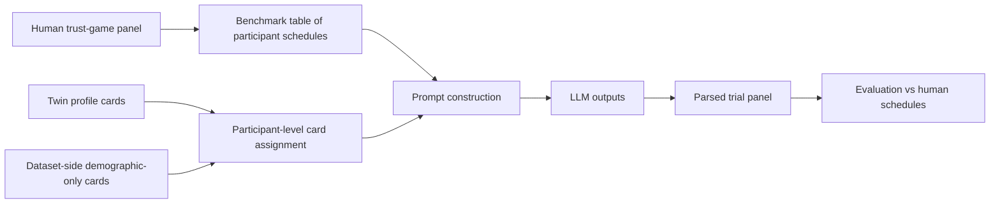

# Longitudinal Trust Game Forecasting Pipeline Overview

## Goal

The goal of this proposed benchmark is to simulate full longitudinal trust-game response panels and compare them to human data from the same design.

The main question mirrors the PGG benchmark:

1. `baseline`
2. `demographic_only_row_resampled_seed_0`
3. `twin_sampled_seed_0`
4. `twin_sampled_unadjusted_seed_0`

Do Twin-derived profile cards help an LLM recover human trust behavior better than no profile card or a lightweight demographic-only card?

## Task Definition

This dataset is a repeated willingness-to-play task rather than a multi-player transcript.

Each human participant:

- completes `10` sessions over `3` weeks
- sees `16` trust trials per session
- rates each trial on a `1` to `9` willingness-to-play scale

Each trial crosses:

- partner sharing probability `X in {65, 70, 75, 80}`
- stake `Y in {1, 2, 4, 5}`

Payoff structure:

- if the participant does not play, both sides keep `5` tokens
- if the participant plays, they give `Y` tokens to the partner
- the partner receives `2Y`
- with probability `X%`, the partner shares and both end with `5 + Y / 2`
- with probability `1 - X`, the partner keeps everything and the participant ends with `5 - Y`

## Canonical Forecasting Unit

The cleanest analogue to the PGG full-rollout task is:

- one forecast record = one participant
- one model output = the participant's full `10 x 16 = 160` rating panel

Recommended canonical output:

- JSON
- ratings ordered lexicographically by `(day, cooperation_probability descending, stake ascending)`
- one integer in `{1, ..., 9}` for each cell

Day-level means such as `MeanTrustGame` can then be derived downstream from the generated trial panel rather than predicted directly.

## What Each Mode Means

### 1. Baseline

No participant background card.

The prompt contains:

- the trust-game rules
- the repeated-session structure
- the full `16`-cell trial grid
- the output schema

### 2. Demographic-only

Variant name:

- `demographic_only_row_resampled_seed_0`

The prompt contains a synthetic participant card built only from target-dataset-side background variables, not Twin-derived content.

For this dataset that likely means:

- age
- gender, if it is recovered reliably from the raw files
- simple SES descriptors derived from childhood and adult resource measures

This mode exists to test whether lightweight background context helps even without transferring Twin-side psychometric content.

### 3. Twin-sampled with demographic correction

Variant name:

- `twin_sampled_seed_0`

The prompt contains one Twin-derived participant card sampled to match the longitudinal-trust benchmark population over the demographic fields that actually overlap between the two datasets.

For this dataset, the overlapping fields are narrower than in PGG. In practice the corrected matching should use:

- age
- sex or gender if recoverable in the benchmark table

and should not assume education is available, because it is not part of the main longitudinal summary file.

### 4. Twin-sampled without demographic correction

Variant name:

- `twin_sampled_unadjusted_seed_0`

This uses the same Twin-derived cards without target-dataset demographic correction.

This mode isolates whether any gain comes from richer Twin-side background content itself versus from demographic alignment.

## End-to-End Stages

## Stage 1: Define The Human Reference Set

Recommended reference set:

- participants who completed all `10` sessions
- raw day files as the source of per-trial ratings
- `matrix_mean.csv` as a secondary summary table for sanity checks

This is a participant-level repeated-measures benchmark. The evaluation should preserve whole schedules rather than treat the `160` trial ratings as independent rows.

## Stage 2: Build The Task Grounding

The prompt should describe:

- the trust-game payoff rule
- the `16` trial types
- the fact that the same participant repeats the task across `10` sessions
- the requirement to output the full schedule from scratch rather than one day at a time

Important conceptual difference from PGG:

- there is no endogenous multi-player interaction trajectory to narrate
- the target is a repeated scalar response surface

## Stage 3: Build The Augmentation Sources

As in the PGG pipeline, there are two non-baseline augmentation families:

- dataset-side demographic-only cards
- Twin-derived cards

The existing top-level `forecasting/` docs and `non-PGG_generalization/twin_profiles/` outputs are the analogue to follow, but the assignment unit here is a participant rather than a seat in a group game.

## Stage 4: Assign One Card Per Forecast Record

This benchmark should use participant-level assignment:

- one synthetic card per simulated participant
- the same card reused across all `10` sessions for that participant

There is no seat structure analogous to PGG because only one focal participant is modeled per record.

## Stage 5: Build LLM Inputs

The benchmark prompt should ask the model to generate the entire panel from scratch.

That means:

- no observed human prefix
- no day-by-day continuation conditioning
- one structured output containing all `160` ratings

This keeps the task aligned with the current `forecasting/` interpretation rather than the legacy `trajectory_completion/` setup.

## Stage 6: Parse And Evaluate

The parser should convert each output into:

- participant-level long format
- day-level means
- trial-cell means and sensitivities

The evaluation should compare generated and human behavior at both the trial-cell level and the participant-trajectory level.

## Recommended Reading Order

1. [../../non-PGG_generalization/data/longitudinal_trust_game_ht863/README.md](../../non-PGG_generalization/data/longitudinal_trust_game_ht863/README.md)
2. [PIPELINE_OVERVIEW.md](PIPELINE_OVERVIEW.md)
3. [ANALYSIS_OVERVIEW.md](ANALYSIS_OVERVIEW.md)
4. [../PIPELINE_OVERVIEW.md](../PIPELINE_OVERVIEW.md)
