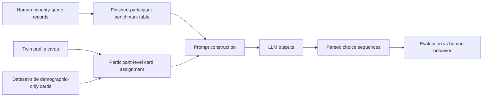

# Minority Game + BRET Forecasting Pipeline Overview

## Goal

The goal of this proposed benchmark is to simulate full minority-game choice sequences from scratch and compare them to human data under the same experimental design.

The main question mirrors the PGG benchmark:

1. `baseline`
2. `demographic_only_row_resampled_seed_0`
3. `twin_sampled_seed_0`
4. `twin_sampled_unadjusted_seed_0`

Do Twin-derived profile cards improve prediction of repeated minority-game behavior relative to no card or a simple demographic-only card?

## Task Definition

Each participant plays an `11`-round "bonus game" and then completes a BRET risk task.

### Bonus Game Rules

- each round the participant chooses `A` or `B`
- round `1` has pot `0`
- for rounds `2` to `11`, the pot depends only on the participant's previous choice

If the previous choice was `A`, the next-round pot is:

- `84, 88, 92, 96, 100, 104, 108, 112, 116, 116`

If the previous choice was `B`, the next-round pot is:

- `20, 40, 60, 80, 100, 120, 140, 160, 180, 180`

The crossover is at round `6`, where both branches yield `100`. After that point, `B` is more profitable than `A`.

### BRET Rules

- there are `100` boxes
- one contains a bomb
- the participant chooses how many boxes to collect
- if the bomb is among the collected boxes, the BRET payoff is `0`

## Canonical Forecasting Unit

Recommended canonical unit:

- one forecast record = one finished participant
- one model output = the full `11`-round choice sequence

Recommended output schema:

```json
{
  "bonus_game_choices": ["A", "A", "A", "A", "A", "B", "B", "B", "B", "B", "B"],
  "bret_boxes": 50
}
```

The main benchmark can treat `bret_boxes` as optional in the first pass if we want to keep the game-forecasting task separate from the risk-elicitation add-on.

## What Each Mode Means

### 1. Baseline

No participant background card.

The prompt contains:

- the minority-game rules
- the exact transition schedule
- the deception condition, if included as a config field
- the output schema

### 2. Demographic-only

Variant name:

- `demographic_only_row_resampled_seed_0`

The prompt contains a synthetic participant card built only from target-dataset demographics such as:

- age
- sex
- education
- employment or student status

This tests whether simple dataset-side background variables already improve the forecast.

### 3. Twin-sampled with demographic correction

Variant name:

- `twin_sampled_seed_0`

The prompt contains one Twin-derived profile card sampled to match the minority-game benchmark population over overlapping fields.

For this dataset the corrected matching can likely use:

- age
- sex
- education

### 4. Twin-sampled without demographic correction

Variant name:

- `twin_sampled_unadjusted_seed_0`

This uses the same Twin-derived cards without target-dataset correction.

## End-to-End Stages



## Stage 1: Define The Human Reference Set

Recommended human comparison set:

- `participant.finished == 1`
- one row per participant from `all_apps_wide-2022-08-31.csv`
- optional demographic join from the Prolific export

The cleanest config label is:

- `participant.in_deception`

That yields two repeated design cells.

## Stage 2: Build The Task Grounding

The prompt should expose the exact mechanics that generate human behavior.

Because this benchmark is from scratch rather than a within-game continuation task, the cleanest canonical prompt is not to reproduce every simulated group-count screen. Instead, it should describe:

- the full `11`-round decision task
- the deterministic transition schedule
- the payment rule

This makes the benchmark reproducible from the data that are actually available.

## Stage 3: Build The Augmentation Sources

As in the PGG benchmark, the non-baseline modes are:

- dataset-side demographic-only cards
- Twin-derived cards

The assignment unit is one focal participant rather than a seat in a many-player game.

## Stage 4: Assign One Card Per Forecast Record

Each forecasted participant gets:

- zero cards in `baseline`
- one dataset-side demographic card in `demographic_only_row_resampled_seed_0`
- one Twin-derived card in the two Twin modes

## Stage 5: Build LLM Inputs

The model should produce the full `11`-round plan from scratch.

Important difference from legacy continuation:

- the prompt does not reveal an observed partial human trajectory
- the model generates the entire decision sequence directly from the rules and config

## Stage 6: Parse And Evaluate

The parser should derive:

- per-round choices
- total number of `A` choices
- switch point
- total potential payoff under the chosen sequence
- BRET boxes, if included

This is the cleanest non-PGG analogue to the current PGG forecasting setup.

## Recommended Reading Order

1. [../../non-PGG_generalization/data/minority_game_bret_njzas/README.md](../../non-PGG_generalization/data/minority_game_bret_njzas/README.md)
2. [PIPELINE_OVERVIEW.md](PIPELINE_OVERVIEW.md)
3. [ANALYSIS_OVERVIEW.md](ANALYSIS_OVERVIEW.md)
4. [../PIPELINE_OVERVIEW.md](../PIPELINE_OVERVIEW.md)
