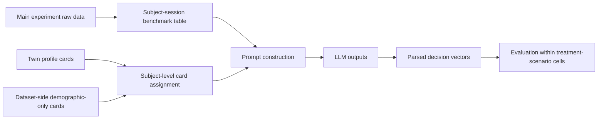

# Multi-Game Battery with LLM Delegation Pipeline Overview

## Goal

The goal of this benchmark is to simulate human choices in the multi-game delegation battery and compare them to human data under the same treatment assignment and nested scenario structure.

The main question mirrors the PGG benchmark:

1. `baseline`
2. `demographic_only_row_resampled_seed_0`
3. `twin_sampled_seed_0`
4. `twin_sampled_unadjusted_seed_0`

Do Twin-derived profile cards improve prediction of economic-game behavior in a setting where AI delegation is experimentally manipulated?

## Task Definition

The core human battery contains five one-shot games across seven role-decisions.

### Economic Decisions

- Ultimatum Game proposer
- Ultimatum Game responder
- Trust Game sender
- Trust Game receiver
- Prisoner's Dilemma
- Stag Hunt
- Coordination game

### Treatment Structure

There are six treatment codes:

- `TRP`
- `TRU`
- `TDP`
- `TDU`
- `ODP`
- `ODU`

Inside each subject-level session, the `Data.R` restructuring implies nested scenario rows indexed by:

- `TreatmentCode`
- `Scenario`
- `Case`

Those nested cells are for evaluation after parsing. They are not the top-level prediction unit.

At the experiment-session level there are `6` repeated designs:

- `TRP`
- `TRU`
- `TDP`
- `TDU`
- `ODP`
- `ODU`

Within each design, multiple recruited participants complete the same session structure. That is the direct analogue of having repeated experiments under the same PGG design.

## Canonical Forecasting Unit

The forecasting unit should be the subject-level experiment session.

That means:

- one forecast record = one participant assigned to one treatment arm
- one LLM request predicts the full battery for that session
- the same record contains multiple nested `Scenario x Case` blocks
- those nested blocks should stay attached to the same participant during sampling and parsing

Recommended primary outputs:

```json
{
  "UGProposer": 5,
  "Responder": 3,
  "Sender": 1,
  "Receiver": 2,
  "PD": 1,
  "SH": 1,
  "C": "Earth"
}
```

Optional secondary outputs:

- role-specific delegation indicators at the session level

## What Each Mode Means

### 1. Baseline

No participant background card.

The prompt contains:

- the game rules
- the treatment and scenario description
- the output schema

### 2. Demographic-only

Variant name:

- `demographic_only_row_resampled_seed_0`

The prompt contains a synthetic participant card built only from target-dataset background variables such as:

- age
- gender
- education

This mode intentionally excludes the richer personality and AI-attitude variables so it stays parallel to the PGG demographic-only logic.

### 3. Twin-sampled with demographic correction

Variant name:

- `twin_sampled_seed_0`

The prompt contains one Twin-derived profile card sampled to match the benchmark population over overlapping fields.

For this dataset, corrected matching can likely use:

- age
- gender
- education

### 4. Twin-sampled without demographic correction

Variant name:

- `twin_sampled_unadjusted_seed_0`

This uses the same Twin-derived cards without target-dataset correction.

## End-to-End Stages



## Stage 1: Define The Human Reference Set

The first implementation step should be to materialize the subject-session table from the raw data, with each row retaining its full nested scenario structure.

Recommended top-level design key:

- `TreatmentCode`

Recommended nested evaluation key after exploding parsed outputs:

- `TreatmentCode x Scenario x Case`

So:

- `6` repeated top-level designs for sampling and subject-level noise-ceiling bootstrapping
- `16` nested evaluation cells for scenario-specific scoring

## Stage 2: Build The Task Grounding

The prompt should describe:

- the five games
- the treatment type
- whether AI support is visible or hidden
- whether the interaction is against a human or AI case
- the exact structured output schema

Unlike PGG, the task is not one dynamic transcript. It is a bundled one-shot decision vector.

## Stage 3: Build The Augmentation Sources

As in PGG, the non-baseline modes are:

- dataset-side demographic-only cards
- Twin-derived cards

Important difference from PGG:

- profile assignment should happen at the subject level
- the same sampled card should be reused across all scenario rows for that `SubjectID`

## Stage 4: Assign One Card Per Subject

Each subject receives:

- zero cards in `baseline`
- one dataset-side demographic card in `demographic_only_row_resampled_seed_0`
- one Twin-derived card in the two Twin modes

That card is then carried into the one subject-level prompt for that same session and therefore implicitly applies to every nested scenario in that row.

## Stage 5: Build LLM Inputs

The benchmark remains from scratch:

- no observed human decisions in the prompt
- one structured subject-level JSON object returned by the model
- that object contains the delegation fields plus all nested scenario outputs for the session

Critical sampling rule:

- sample rows, not scenario content inside rows
- if you downsample, do it at the subject/session level within each treatment arm
- keep every sampled row intact

This is aligned with the current `forecasting/` interpretation rather than legacy continuation.

## Stage 6: Parse And Evaluate

The parser should derive:

- game-specific marginal outcomes
- optional delegation outcomes
- scenario-row summaries

Evaluation should respect the repeated-measures structure by tracking which scenario rows came from the same `SubjectID`.

## Recommended Reading Order

1. [../../non-PGG_generalization/data/multi_game_llm_fvk2c/README.md](../../non-PGG_generalization/data/multi_game_llm_fvk2c/README.md)
2. [PIPELINE_OVERVIEW.md](PIPELINE_OVERVIEW.md)
3. [ANALYSIS_OVERVIEW.md](ANALYSIS_OVERVIEW.md)
4. [../PIPELINE_OVERVIEW.md](../PIPELINE_OVERVIEW.md)
