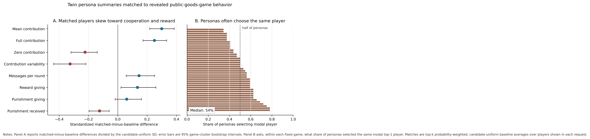

# When Diverse Personas Collapse: Auditing Persona Libraries Against Revealed Human Behavior

## Status

Working manuscript draft. The empirical claims in the Results section currently report the completed Twin-to-PGG pilot and the larger 32 persona x 40 game lean run. The larger run should still be treated as preliminary until we add additional persona libraries, matcher models, and target games.

## Candidate Titles

1. When Diverse Personas Collapse: Auditing Persona Libraries Against Revealed Human Behavior
2. Persona Libraries Can Be Diverse in Source Space but Skewed in Target Behavior
3. An Optimistic Test of Persona-Based Human Simulation
4. Revealed-Behavior Coverage as an Evaluation for LLM Persona Simulation

## Abstract

Large language models are increasingly used to simulate human participants in surveys, markets, games, and social interactions. A common strategy is persona prompting: researchers provide demographic profiles, psychological descriptions, interview summaries, or synthetic persona cards, then ask a model to answer or act as the described person. This approach is promising because it offers a scalable way to represent heterogeneous populations. But it also creates an unresolved transfer problem. A persona may appear diverse in its source domain while mapping, through an LLM, to a much narrower set of behaviors in a new target environment.

We introduce a revealed-behavior transfer audit for persona libraries. Instead of asking an LLM to generate new actions from a persona and then comparing simulated outcomes to human outcomes, we ask the model to match each persona to real participants in completed target interactions. Given a persona summary and the full transcript of a public goods game, the model returns a sparse probability distribution over the players whose behavior the persona could most plausibly have produced. Aggregating these matches estimates the behavioral support covered by the persona-library-plus-model system. This design is an optimistic test: the model need not invent calibrated contribution, punishment, reward, or communication patterns, but only select among behaviors that actually occurred.

In an initial evaluation using direct Twin persona summaries and observed public goods games, matched players were more cooperative than the candidate player population shown to the model. In a 32 persona x 40 game run, matched players had higher mean contribution rates, higher full-contribution rates, lower zero-contribution rates, lower contribution variability, higher reward-giving rates, and lower punishment-received rates. The match distribution covered many observed identities, but unevenly: top-1 matches reached 200 of 342 candidate players, while the probability-weighted effective number of matched identities was 188. These preliminary results suggest that persona diversity in source space may compress into skewed behavioral coverage in target-action space. More broadly, the audit provides a diagnostic for persona-based simulation before researchers rely on downstream rollout outcomes.

## Introduction

Large language models (LLMs) have made it newly plausible to simulate human responses at scale. In political science, LLMs conditioned on demographic backstories have been used to construct "silicon samples" that reproduce survey response patterns across subpopulations. In psychology and behavioral economics, LLMs have been evaluated through replications of classic human-subject studies. In human-computer interaction and agent-based modeling, generative agents use memory, planning, reflection, and natural-language action descriptions to create believable social worlds. Together, these lines of work suggest that LLMs can sometimes serve as inexpensive, flexible approximations of human respondents or agents.

The central appeal is heterogeneity. Social and behavioral scientists rarely need a single average human. They need populations that differ in preferences, beliefs, identities, conversational styles, strategic reasoning, and social norms. Persona prompting offers a direct way to elicit this variation. A researcher can condition the model on a person's demographic background, a survey profile, an interview summary, a psychological inventory, or a generated persona card, then ask the model to answer as that person. Recent work has therefore moved beyond asking whether an unconditioned model gives human-like answers and toward asking whether conditioned models can emulate particular subgroups, individuals, or synthetic populations.

Yet the promise of persona prompting depends on a transfer step that is usually left implicit. A persona is not a behavioral policy. It is a textual description that an LLM must translate into actions in a particular environment. The same profile may need to imply a vote choice in one study, a fairness judgment in another, a contribution path in a public goods game, or a bargaining strategy in a negotiation. There is no direct function from the source persona to the target behavior. The function is supplied by the model.

Most existing evaluations measure the final product of that translation. They ask whether simulated survey answers match human survey answers, whether synthetic participants reproduce known experimental effects, whether simulated agents behave believably, or whether persona-conditioned outputs align with demographic groups. These evaluations are necessary, but they conflate two sources of failure. A persona library may fail because it does not contain the kinds of people who appear in the target setting. Or it may fail because the LLM is poorly calibrated when converting even a good persona into numeric actions, messages, or choices.

This distinction matters for strategic interactions. In a public goods game, an LLM can be given a rich profile of a person and still overcontribute, overpunish, under-reward, write too much, fail to decay after repeated disappointment, or misread strategic incentives. If a rollout simulation then fails to match human outcomes, we do not know whether the persona library lacked the relevant behavioral types or whether the model could not produce those behaviors when asked to act. Conversely, if aggregate outcomes look plausible, the simulation may still have collapsed many distinct personas onto a narrow set of convenient behavioral scripts.

We propose a complementary evaluation: audit persona libraries against revealed target behavior before asking the model to generate new behavior. Given a persona and an observed interaction, the model chooses which real participant in the interaction most closely matches the persona. Repeating this procedure over many persona-game pairs produces a distribution over actual target-study participants. That distribution can be compared with the empirical distribution of human behavior in the target study. If the matched players are too cooperative, too punitive, too chatty, too quiet, or concentrated on a small subset of observed identities, then the persona-library-plus-model system is not covering the relevant behavioral support.

This audit is stricter in one sense and easier in another. It is stricter because it evaluates whether persona evidence maps onto individual revealed behavior, including communication patterns and dynamic responses, rather than only aggregate outcome moments. It is easier because the model does not need to synthesize a complete action trajectory. It only chooses among real trajectories. The test is therefore optimistic for persona-based simulation: if the system cannot recover the right region of human behavior when all candidate behaviors are already available, a free-form rollout is unlikely to recover the target distribution without additional correction.

The paper makes three contributions. First, it defines revealed-behavior coverage as an evaluation target for persona libraries. Second, it introduces a practical matching assay that separates persona-to-behavior support from action-level calibration. Third, it provides preliminary evidence, using Twin persona summaries and public goods games, that apparently diverse personas can map to a skewed and overly cooperative subset of observed human players.

## Related Work

### LLMs As Simulated Humans

Early work on LLM-based social simulation showed that language models can reproduce some patterns in human survey and experimental data. Argyle et al. introduced "silicon samples" and the concept of algorithmic fidelity, arguing that demographic conditioning can induce response distributions that mirror human subpopulations in U.S. public opinion. Aher, Arriaga, and Kalai proposed "Turing Experiments," evaluating whether LLMs can simulate representative samples of participants in human-subject studies such as ultimatum games and social psychology experiments. These studies established that LLMs can sometimes reproduce meaningful aggregate patterns, but they primarily evaluate generated responses after the model has already translated a prompt into an answer or action.

More recent benchmarks have broadened the scope. SimBench standardizes evaluation across many human-behavior datasets and reports that current models have meaningful but limited simulation ability, with particular difficulty on high-entropy and demographic-specific behavior. Other work examines LLM behavior in repeated games, dictator games, debate settings, and strategic games, often finding that models exhibit systematic behavioral signatures that differ from humans. These studies provide important evidence about model behavior as behavior. Our focus is different: we ask whether a persona library, when mediated by a model, covers the revealed human behavioral types in a target environment.

### Persona Prompting And Persona Libraries

Persona prompting has become a dominant strategy for eliciting heterogeneity. The basic idea is simple: describe a person, then ask the model to answer or act as that person. The description can be demographic, psychographic, autobiographical, interview-derived, or synthetically generated. This practice builds directly on the algorithmic-fidelity intuition that the conditioning context can select among different response distributions inside the model.

However, prompt wording and persona construction matter. Lutz et al. show that sociodemographic persona prompts are sensitive to role-adoption format and demographic priming, and that models struggle to represent marginalized groups reliably. Li et al. argue that LLM-generated personas are promising but biased, showing that current generation practices can produce systematic deviations in downstream election forecasts and opinion surveys. Paglieri et al. explicitly distinguish density matching from support coverage, proposing persona generators that optimize for diversity across relevant axes rather than merely reproducing the most probable profiles.

These papers sharpen the need for the present audit. If persona libraries are judged only by source-space attributes or synthetic diversity metrics, they may appear broad while failing to cover target behaviors after LLM-mediated transfer. A library that contains rare trait combinations, realistic descriptions, or balanced demographic marginals may still collapse when the model is asked what those personas would do in a new strategic setting.

### Generative Agents And Agent-Based Simulation

Generative agents and related toolkits such as Concordia extend persona prompting into interactive simulations. Agents can remember, reflect, plan, communicate, and act in natural language. These systems are valuable because they make social simulation more flexible: agents can operate in settings where actions and contexts are too rich to encode with fixed equations. But that flexibility raises the evaluation burden. If the model is responsible for translating a persona into actions, then fidelity depends not only on the surface plausibility of the persona or the believability of the interaction, but on whether the resulting behaviors preserve the empirical distribution of the target population.

This is the point at which revealed-behavior coverage becomes useful. It can be applied before a full agent-based simulation, using completed human interactions as a target. It asks whether the source personas are mapped by the LLM into the kinds of people who actually appeared in the target environment.

### Evaluation Gap

Existing evaluations tend to ask one of three questions. First, do generated responses reproduce aggregate human distributions? Second, do persona-conditioned responses align with known subgroup differences? Third, are generated agents believable or strategically competent in a task? These are important questions, but none directly measures the support mismatch between a persona library and a target interaction.

The missing question is: when a model is given a persona from a source library and shown real behavior in a target domain, which real people does the persona resemble? This question is narrower than full simulation, but it is directly diagnostic of whether the library can represent target-study heterogeneity. It also avoids a major confound in rollout evaluation: action-level miscalibration. Because the candidate behaviors are real, any skew in the matched distribution reflects how the persona-library-plus-model system selects among revealed human behaviors, not whether it can numerically generate those behaviors from scratch.

## Conceptual Framework

Let a persona library contain source descriptions \(p \in P\). Let a target study contain observed participants \(i \in I\), each with a revealed behavior trajectory \(b_i\) in a specific environment. A standard persona-based simulation asks an LLM to generate a new behavior trajectory \(\hat{b}(p, e)\) for persona \(p\) in environment \(e\), then compares the distribution of \(\hat{b}\) with the distribution of human behavior \(b\).

The transfer audit instead estimates a matching distribution:

\[
M(i \mid p, G) = \Pr(\text{model selects observed participant } i \text{ as behaviorally aligned with persona } p \text{ in game } G).
\]

Aggregating over personas and games gives an induced distribution over observed target-study participants:

\[
\bar{M}(i) = \mathbb{E}_{p,G}[M(i \mid p,G)].
\]

The key diagnostic is whether \(\bar{M}\) resembles the target participant distribution on behavioral features. If the target population includes high contributors, low contributors, conditional cooperators, punishers, rewarders, coordinators, and quiet participants, a well-covered persona library should place mass across those regions. A collapsed transfer system will place too much mass on a small or skewed subset.

This is not a model-free estimate of the true relationship between source personas and target people. The model is part of the estimand. That is intentional. Researchers who use persona libraries for simulation are already relying on an LLM to decide how the persona maps into the new environment. The audit measures that full transfer system.

## Method

### Target Environment

The initial target domain is an online public goods game. Players participate in repeated rounds. Each round, players decide how much of an endowment to contribute to a shared pot. The shared pot is multiplied and redistributed. Depending on treatment, players may also punish or reward others after contributions are revealed, and some games include group chat. The transcript records contributions, punishment or reward actions, summary information, and messages.

Public goods games are useful for this audit because they contain several behaviorally meaningful dimensions: cooperation level, contribution dynamics, reciprocity, norm enforcement, reward use, punishment use, and communication. They also make aggregate simulation deceptively easy. A simulation may match average contribution while missing who communicates, who enforces norms, who free rides, or who changes behavior over time.

### Persona Library

The first library is the direct Twin persona summary used in SimBench-style simulation. We intentionally use the original persona summary rather than a PGG-specialized transfer card. A PGG-specialized card already translates source information into target-relevant cues. The audit instead tests whether the direct persona summary, as a general-purpose persona representation, maps into PGG behavior through the LLM.

Future analyses will compare Twin direct summaries with Twin task-specialized cards, demographic-only profiles, Tianyi-Lab generated personas, NVIDIA Nemotron personas, Salesforce SCOPE-style personas, and persona generators that explicitly optimize for support coverage.

### Matching Prompt

For each request, the model receives one persona summary and one observed game transcript. The system instruction is deliberately simple: the model is told to behave as a person with the given profile and identify which player in the provided social interaction matches most closely with its personality. The user prompt begins with information about the persona, then describes the public goods game rules and the transcript format, then presents the observed interaction.

The prompt avoids exposing metadata such as persona IDs, game IDs, treatment labels, or validation labels. These identifiers are kept in the request metadata and manifest only. This prevents the model from treating database structure as substantive information.

The model returns valid JSON with `top_matches`: up to three observed players and probabilities that sum to one. Unlisted players are treated as having probability zero. Top-k probabilities are used because some target games contain many players; exhaustive rankings can become tedious and less reliable. The top-k format preserves the strongest alignment judgments while allowing uncertainty among the most plausible candidates.

### Outcomes

We evaluate both concentration and behavioral skew.

Concentration diagnostics include top-1 coverage, top-k probability coverage, effective number of matched player identities, mass captured by the most-selected identities, and repeated selection of the same observed participants across personas and games. Behavioral diagnostics compare matched players with a candidate-uniform baseline over the players shown in each request. Metrics include mean contribution rate, full-contribution rate, zero-contribution rate, within-player contribution variability, messages per round, reward-giving rate, punishment-giving rate, and punishment-received rate.

We keep avatar labels in the transcript because players use them when communicating. However, avatar labels are not stable person identities: the same label can refer to a different participant in each game. We therefore treat avatar-level imbalance as a prompt and presentation diagnostic, not as substantive evidence that a particular behavioral type is being selected.

The candidate-uniform baseline is important because each request shows a different game. The comparison asks whether the model-selected players differ from the local candidate set available in that request, not whether the sampled games happen to differ from the entire PGG corpus.

### Statistical Inference

For pilot diagnostics, we report request-level paired differences between matched behavior and the candidate-uniform baseline. We use bootstrap intervals and paired sign tests at the request level, with additional cluster-bootstrap intervals by game and by persona. The request-level analysis is useful for fast diagnosis, but game-cluster intervals are more conservative when the number of games is small. Larger runs are designed to increase the number of target games and treatments so that clustering by game becomes more informative.

## Preliminary Results

### Design And Data Quality

We first ran a small pilot crossing 8 Twin direct persona summaries with 5 observed PGG games, producing 40 persona-game requests. The pilot was used to inspect prompts, validate structured output, and confirm that the evaluation pipeline recovered behavior features from matched players.

We then ran a larger lean evaluation crossing 32 non-pilot Twin personas with 40 validation games, selecting one complete game from each treatment. This produced 1,280 persona-game requests. The model returned parseable top-k JSON for 1,279 requests. One request returned empty content after exhausting the completion budget; the remaining parsed requests had no probability-sum errors and no duplicate players within top-k lists.

Figure 1 summarizes the main result from the larger run. Panel A reports probability-weighted differences between matched players and the candidate-uniform baseline, standardized by the candidate-uniform standard deviation for each behavior metric. Error bars are 95% game-cluster bootstrap intervals. Panel B asks whether top-1 choices collapse within each fixed game transcript. For each game, it reports the share of personas that selected the modal top-1 player.

### Match Concentration

The larger run showed substantial coverage, but not uniform coverage. Across 342 candidate observed players, the model selected 200 unique top-1 player identities, covering 58.5% of the observed identities available across requests. The top-k probability distribution assigned positive mass to 313 identities, or 91.5% of candidates. The effective number of top-1 player identities was 131.55, and the effective number using probability mass was 188.44, equal to 55.1% of the candidate pool. Thus the match distribution did not collapse into one or a few individual players.

However, the cleaner coverage question is within-game: holding the transcript fixed, do different personas select different players as their closest behavioral match? On this metric, the distribution was often uneven. The median most-selected player in a game received 54.0% of top-1 choices across personas. The median game had a top-1 effective number equal to 47.0% of the players in that game. This is not a single-player collapse across the entire dataset, but within many games the personas concentrated on a small subset of observed players.

The avatar-label diagnostic showed a strong imbalance, with one reused label receiving 29.3% of probability mass in the larger run. Because these labels are random within games and are reused for different people across games, this result should not be interpreted as a substantive preference for a stable player type. It instead flags a presentation feature that should be tracked in future runs. Since labels are used inside the communication transcript, removing or shuffling them is not a neutral transformation unless all within-transcript references are transformed consistently.

### Behavioral Skew

Matched players were more cooperative than the candidate players shown in the same requests. In the larger run, the probability-weighted mean contribution rate was 0.831 for matched players versus 0.753 under the candidate-uniform baseline, a difference of 0.077. The full-contribution rate was 0.726 versus 0.638, a difference of 0.089. The zero-contribution rate was 0.095 versus 0.147, a difference of -0.052. Matched players also had lower contribution variability, with a difference of -1.142 contribution units.

These differences were stable under game-cluster uncertainty. The 95% game-cluster bootstrap interval was [0.056, 0.099] for mean contribution rate, [0.061, 0.118] for full-contribution rate, [-0.074, -0.032] for zero-contribution rate, and [-1.535, -0.764] for contribution variability. Persona-cluster intervals led to the same qualitative conclusions.

Reward behavior showed a smaller but still stable positive skew. Reward-giving round rate was 0.165 among matched players versus 0.129 under the candidate-uniform baseline, a difference of 0.036, with a game-cluster interval of [0.006, 0.070]. Matched players were also less likely to have received punishment: punishment-received round rate was 0.056 versus 0.078, a difference of -0.022, with a game-cluster interval of [-0.035, -0.010]. Punishment-giving was weaker and less stable: the difference was 0.011, and the game-cluster interval included zero.

### Interpretation

The larger run supports the central diagnostic claim from the pilot. When choosing among real PGG participants, the Twin-summary-plus-model system selected players who were more cooperative, less variable in their contributions, more likely to reward, and less likely to be punished than the local candidate set. This cannot be explained as a failure to numerically generate contributions or punishment decisions, because the model was not asked to generate those actions. It only selected among revealed human trajectories.

This is an optimistic failure mode. The model did not have to invent cooperation, punishment, reward, or chat from scratch. It only had to identify which observed players were most behaviorally aligned with each persona. If the matched distribution is already shifted toward more cooperative and reward-giving players under this easier matching task, then direct persona-conditioned rollout simulation may inherit a hidden support problem before action generation begins.

### Extension To Chip Bargaining

We also piloted the same audit in a three-player chip-bargaining game. In this environment, players have private values for colored chips and make repeated trade proposals. The target transcript records offers, acceptances, selected recipients, and final welfare. Because each game has three players, `top_k=3` gives the model the opportunity to allocate probability across the full local candidate set.

The chip-bargaining pilot crossed 8 Twin personas with 6 games, producing 48 requests. Coverage was high in this small sample: top-1 matches reached 16 of 18 observed player identities, and top-k probability mass reached all 18. The probability-weighted effective number of matched identities was 16.28. Behavioral skews were smaller than in PGG, but the matched distribution placed more mass on players who accepted more often as responders and who were more likely to receive trades. A larger 32 persona x 48 game chip-bargaining run is currently in progress. We treat the pilot as a validation of the cross-game pipeline rather than as a stable estimate of bargaining-transfer skew.

## Discussion

Persona prompting has often been evaluated by asking whether generated outcomes match human outcomes. That is the right final question, but it is not the only question researchers need. Before relying on a persona library to simulate a new environment, we should know whether the library maps onto the behavioral support of that environment. A simulation can fail because the generated actions are miscalibrated, but it can also fail because the persona library does not induce the right kinds of people in the target task.

The revealed-behavior transfer audit isolates this second problem as much as possible. It gives the model real target behaviors and asks which ones fit each persona. If the induced match distribution is skewed, the problem is not merely that the model cannot choose the right number of coins or produce the right punishment amount. The problem is that the persona-library-plus-model system selects the wrong region of human behavior.

This distinction matters for both scientific and applied uses of LLM simulation. In social science, persona-based simulations may be used to pilot experiments, explore mechanisms, or forecast responses before costly data collection. In product research or policy analysis, synthetic personas may be used to estimate how different user populations would react to interventions. In agent-based modeling, personas may initialize populations whose interactions generate emergent outcomes. In all of these settings, source-space diversity is not enough. The relevant question is whether diversity survives transfer to the action space of the target environment.

The audit also reframes LLM bias. A model's tendency to prefer cooperative, articulate, normative, or strategically coherent players is not simply a nuisance to eliminate. It is part of the deployed transfer mechanism. Researchers can vary the matcher model, compare baseline and persona-augmented prompts, and test multiple persona libraries, but the bias itself is diagnostically meaningful. It tells us how a particular simulation system will translate textual profiles into target behavior.

The next empirical step is to vary both the persona source and the target environment. A no-persona baseline estimates the model's default attraction to particular observed behaviors. Minimal demographic profiles, direct Twin summaries, task-specialized Twin cards, and generated persona libraries can then be compared against that baseline. If different persona libraries all map to the same narrow region of target behavior, the problem lies partly in the model-mediated transfer function. If some libraries improve coverage or reduce behavioral skew, the audit can identify which representations carry target-relevant behavioral support.

## Limitations

The audit depends on the matcher model. A different model may map the same persona library to different target participants. This is not a flaw in the estimand, but it means results should be reported as properties of persona-library-plus-model systems rather than persona libraries alone.

The top-k format compresses uncertainty. In large games, a persona may plausibly match many players, but the prompt asks the model to allocate probability over at most three. Larger top-k values or full distributions are useful robustness checks when context length and cognitive load permit.

The current assay uses within-game candidate sets. This controls local context but does not directly ask the model to search across the entire target population. Cross-game retrieval or pairwise matching designs may provide complementary evidence.

The current main target environment is PGG, with chip bargaining now being piloted as a second strategic interaction. Public goods games are rich and useful, but the broader claim requires tests in bargaining, trust, coordination, debate, survey, and open-ended communication settings. The strongest evidence would show systematic support mismatch across multiple target environments and persona libraries.

## Planned Analyses

1. Compare direct Twin summaries with PGG-specialized Twin cards.
2. Run no-persona, demographic-only, and generated-persona library baselines.
3. Repeat the assay on chip bargaining and other available multi-agent economic games with structured behavior and communication transcripts.
4. Vary matcher models to estimate model-specific and model-stable skew.
5. Link match skew to rollout simulation error: overmatched cooperation should predict overcontribution in free-form simulation, overmatched norm enforcement should predict overpunishment, and overmatched communication should predict excessive coordination messages.
6. Add behavioral clustering so matched support can be compared at the level of behavioral types rather than individual raw metrics alone.

## References To Incorporate

- Aher, G., Arriaga, R. I., & Kalai, A. T. Using Large Language Models to Simulate Multiple Humans and Replicate Human Subject Studies. ICML 2023. https://www.microsoft.com/en-us/research/publication/using-large-language-models-to-simulate-multiple-humans-and-replicate-human-subject-studies/
- Akata, E., Schulz, L., Coda-Forno, J., Oh, S. J., Bethge, M., & Schulz, E. Playing repeated games with large language models. Nature Human Behaviour, 2025. https://www.nature.com/articles/s41562-025-02172-y
- Argyle, L. P., Busby, E. C., Fulda, N., Gubler, J. R., Rytting, C., & Wingate, D. Out of One, Many: Using Language Models to Simulate Human Samples. Political Analysis, 2023. https://www.cambridge.org/core/journals/political-analysis/article/out-of-one-many-using-language-models-to-simulate-human-samples/035D7C8A55B237942FB6DBAD7CAA4E49
- Gao, C. et al. Large language models empowered agent-based modeling and simulation: a survey and perspectives. Humanities and Social Sciences Communications, 2024. https://www.nature.com/articles/s41599-024-03611-3
- Gui, G., & Toubia, O. The Challenge of Using LLMs to Simulate Human Behavior: A Causal Inference Perspective. SSRN, revised 2025. https://papers.ssrn.com/sol3/papers.cfm?abstract_id=4650172
- Hu, T., Baumann, J., Lupo, L., Hovy, D., Collier, N., & Roettger, P. SimBench: Benchmarking the Ability of Large Language Models to Simulate Human Behaviors. arXiv, 2025. https://huggingface.co/papers/2510.17516
- Li, A., Chen, H., Namkoong, H., & Peng, T. LLM Generated Persona is a Promise with a Catch. NeurIPS Position Paper Track, 2025. https://openreview.net/forum?id=qh9eGtMG4H
- Lutz, M., Sen, I., Ahnert, G., Rogers, E., & Strohmaier, M. The Prompt Makes the Person(a): A Systematic Evaluation of Sociodemographic Persona Prompting for Large Language Models. Findings of EMNLP, 2025. https://aclanthology.org/2025.findings-emnlp.1261/
- Paglieri, D., Cross, L., Cunningham, W. A., Leibo, J. Z., & Vezhnevets, A. S. Persona Generators: Generating Diverse Synthetic Personas at Scale. arXiv, 2026. https://arxiv.org/abs/2602.03545
- Park, J. S., O'Brien, J. C., Cai, C. J., Morris, M. R., Liang, P., & Bernstein, M. S. Generative Agents: Interactive Simulacra of Human Behavior. UIST, 2023. https://huggingface.co/papers/2304.03442
- Vezhnevets, A. S. et al. Generative agent-based modeling with actions grounded in physical, social, or digital space using Concordia. arXiv, 2023. https://deepmind.google/research/publications/64717/
