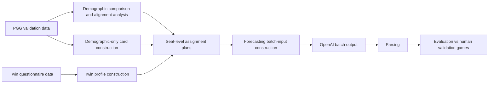

# PGG Forecasting Pipeline Overview

## Goal

The goal of this pipeline is to use LLMs to simulate full public goods games under many experimental configurations and compare the simulated behavior to human validation-wave PGG data.

The main question is whether adding player background information improves prediction, and if so, which kind of augmentation helps:

1. `baseline`
2. `demographic_only_row_resampled_seed_0`
3. `twin_sampled_seed_0`
4. `twin_sampled_unadjusted_seed_0`

These are all evaluated on the same validation-wave forecasting task.

## What Each Mode Means

### 1. Baseline

No external player profile augmentation.

The prompt contains:

- the game rules
- the game configuration
- the simulation instruction

It does not contain any player-specific background card.

Why this mode exists:

- establishes the no-augmentation reference point

### 2. Demographic-only

Variant name:

- `demographic_only_row_resampled_seed_0`

The prompt contains synthetic player cards built only from PGG-side demographic information:

- age
- sex/gender
- education
- ethnicity
- country of birth
- country of residence
- nationality
- employment status

These cards are sampled from the validation-wave PGG demographic pool and assigned to validation seats without preserving the real player-to-game linkage.

Prompt-note convention:

- no shared common caution block is used for this augmentation mode

Why this mode exists:

- tests whether lightweight background context helps even without behavioral or personality information
- isolates the value of demographics alone

### 3. Twin-augmented with demographic correction

Variant name:

- `twin_sampled_seed_0`

The prompt contains player cards derived from the Twin dataset. These are assigned to validation-wave PGG seats after matching the aggregate PGG validation demographic distribution over:

- age
- male/female
- education

Prompt-note convention:

- these runs include the shared common caution / interpretation note that was chosen for the Twin-derived profiles

Why this mode exists:

- tests whether richer non-PGG questionnaire evidence transfers to PGG
- corrects for the known demographic mismatch between Twin and PGG

### 4. Twin-augmented without demographic correction

Variant name:

- `twin_sampled_unadjusted_seed_0`

This is the same Twin-derived card set, but the seat assignment is sampled without demographic correction.

Why this mode exists:

- isolates the value of demographic alignment itself
- lets us compare the effect of correction vs. uncorrected Twin sampling

## End-to-End Stages

## Stage 1: Define The Forecasting Task

The forecasting task is full-rollout PGG simulation on validation games.

Key files:

- [`data/processed_data/df_analysis_val.csv`](../../data/processed_data/df_analysis_val.csv)
- [`forecasting/pgg/build_batch_inputs.py`](./build_batch_inputs.py)
- [`forecasting/pgg/README.md`](./README.md)

Important constraint:

- all four modes should use the same validation selection and evaluation pipeline so the comparison stays apples-to-apples

## Stage 2: Establish The Demographic Shift

Before transferring Twin-derived personas into PGG, we quantify how the participant pools differ.

Validation-only comparison:

- [`demographics/analysis_pgg_vs_twin/combined_distribution_comparison.png`](../../demographics/analysis_pgg_vs_twin/combined_distribution_comparison.png)
- [`demographics/analysis_pgg_vs_twin/README.md`](../../demographics/analysis_pgg_vs_twin/README.md)

Validation-only extended comparison:

- [`demographics/analysis_pgg_validation_extended_vs_twin/combined_extended_comparison.png`](../../demographics/analysis_pgg_validation_extended_vs_twin/combined_extended_comparison.png)
- [`demographics/analysis_pgg_validation_extended_vs_twin/README.md`](../../demographics/analysis_pgg_validation_extended_vs_twin/README.md)

Main conclusion motivating the corrected Twin mode:

- age and education differ materially between Twin and PGG
- male/female is relatively well aligned
- employment and nationality/residence proxies differ strongly in the broader comparison

## Stage 3: Build The Augmentation Sources

### Twin-derived player cards

These are built from the Twin questionnaire and behavioral data, then rendered into prompt-facing cards.

Core files:

- [`non-PGG_generalization/twin_profiles/TWIN_EXTENDED_PROFILE_SPEC.md`](../../non-PGG_generalization/twin_profiles/TWIN_EXTENDED_PROFILE_SPEC.md)
- [`non-PGG_generalization/twin_profiles/build_twin_extended_profiles.py`](../../non-PGG_generalization/twin_profiles/build_twin_extended_profiles.py)
- [`non-PGG_generalization/twin_profiles/render_twin_extended_profile_cards.py`](../../non-PGG_generalization/twin_profiles/render_twin_extended_profile_cards.py)

Prompt-facing Twin cards:

- [`non-PGG_generalization/twin_profiles/output/twin_extended_profile_cards/pgg_prompt_min/twin_extended_profile_cards.jsonl`](../../non-PGG_generalization/twin_profiles/output/twin_extended_profile_cards/pgg_prompt_min/twin_extended_profile_cards.jsonl)

### PGG-side demographic-only cards

These are not Twin-derived. They are synthetic profiles built only from the validation-wave PGG demographic pool.

Core files:

- [`forecasting/pgg/profile_sampling/PGG_VALIDATION_DEMOGRAPHIC_ONLY_PROFILES.md`](./profile_sampling/PGG_VALIDATION_DEMOGRAPHIC_ONLY_PROFILES.md)
- [`forecasting/pgg/profile_sampling/sample_pgg_demographic_only_profiles_for_validation.py`](./profile_sampling/sample_pgg_demographic_only_profiles_for_validation.py)

Prompt-facing demographic-only cards:

- [`forecasting/pgg/profile_sampling/output/pgg_validation_demographic_only_sampling_row_resampled/seed_0/demographic_profile_cards.jsonl`](./profile_sampling/output/pgg_validation_demographic_only_sampling_row_resampled/seed_0/demographic_profile_cards.jsonl)

## Stage 4: Assign Cards To Validation Seats

This stage creates a synthetic seat-level assignment for each valid-start validation game.

### Corrected Twin assignment

- [`forecasting/pgg/profile_sampling/TWIN_TO_PGG_VALIDATION_PERSONA_SAMPLING.md`](./profile_sampling/TWIN_TO_PGG_VALIDATION_PERSONA_SAMPLING.md)
- [`forecasting/pgg/profile_sampling/output/twin_to_pgg_validation_persona_sampling/seed_0/game_assignments.jsonl`](./profile_sampling/output/twin_to_pgg_validation_persona_sampling/seed_0/game_assignments.jsonl)

### Unadjusted Twin assignment

- [`forecasting/pgg/profile_sampling/output/twin_to_pgg_validation_persona_sampling_unadjusted/seed_0/game_assignments.jsonl`](./profile_sampling/output/twin_to_pgg_validation_persona_sampling_unadjusted/seed_0/game_assignments.jsonl)

### Demographic-only assignment

- [`forecasting/pgg/profile_sampling/output/pgg_validation_demographic_only_sampling_row_resampled/seed_0/game_assignments.jsonl`](./profile_sampling/output/pgg_validation_demographic_only_sampling_row_resampled/seed_0/game_assignments.jsonl)

Important conceptual point:

- these assignments preserve the validation game structure
- they do not preserve the real identity of who actually played each game

## Stage 5: Build LLM Batch Inputs

This is where the forecasting prompt is assembled.

Main script:

- [`forecasting/pgg/build_batch_inputs.py`](./build_batch_inputs.py)

This script maps each variant name to:

- no cards for `baseline`
- Twin seat assignments plus Twin cards for `twin_sampled_seed_0`
- Twin unadjusted seat assignments plus Twin cards for `twin_sampled_unadjusted_seed_0`
- demographic-only seat assignments plus demographic-only cards for `demographic_only_row_resampled_seed_0`

Current request files:

- [`forecasting/pgg/batch_input/baseline_gpt_5_1.jsonl`](./batch_input/baseline_gpt_5_1.jsonl)
- [`forecasting/pgg/batch_input/demographic_only_row_resampled_seed_0_gpt_5_1.jsonl`](./batch_input/demographic_only_row_resampled_seed_0_gpt_5_1.jsonl)
- [`forecasting/pgg/batch_input/twin_sampled_seed_0_gpt_5_1.jsonl`](./batch_input/twin_sampled_seed_0_gpt_5_1.jsonl)
- [`forecasting/pgg/batch_input/twin_sampled_unadjusted_seed_0_gpt_5_1.jsonl`](./batch_input/twin_sampled_unadjusted_seed_0_gpt_5_1.jsonl)

Equivalent `gpt_5_mini` files exist as well.

## Stage 6: Store Batch Metadata And Outputs

For each run:

- raw request JSONL goes in `forecasting/pgg/batch_input/`
- raw batch result JSONL goes in `forecasting/pgg/batch_output/`
- run-specific metadata goes in `forecasting/pgg/metadata/<run_name>/`

The metadata directory is the best local source of truth for a run because it contains:

- selected games
- manifest
- parsed output
- request manifest
- token estimates when available

## Stage 7: Parse And Evaluate

Parsing:

- [`forecasting/pgg/parse_outputs.py`](./parse_outputs.py)

Evaluation and analysis:

- [`forecasting/pgg/evaluate_outputs.py`](./evaluate_outputs.py)
- [`forecasting/pgg/analyze_vs_human_treatments.py`](./analyze_vs_human_treatments.py)
- [`forecasting/pgg/compare_models_with_noise_ceiling.py`](./compare_models_with_noise_ceiling.py)
- [`forecasting/pgg/exploratory/plot_macro_pointwise_alignment.py`](./exploratory/plot_macro_pointwise_alignment.py)
- [`forecasting/pgg/exploratory/analyze_micro_distribution_alignment.py`](./exploratory/analyze_micro_distribution_alignment.py)
- [`forecasting/pgg/ANALYSIS_OVERVIEW.md`](./ANALYSIS_OVERVIEW.md)
- [`forecasting/pgg/registry/analysis_registry.csv`](./registry/analysis_registry.csv)

Representative result directories:

- [`forecasting/pgg/results/baseline_gpt_5_1__vs_human_treatments`](./results/baseline_gpt_5_1__vs_human_treatments)
- [`forecasting/pgg/results/demographic_only_row_resampled_seed_0_gpt_5_1__vs_human_treatments`](./results/demographic_only_row_resampled_seed_0_gpt_5_1__vs_human_treatments)
- [`forecasting/pgg/results/twin_sampled_seed_0_gpt_5_1__vs_human_treatments`](./results/twin_sampled_seed_0_gpt_5_1__vs_human_treatments)
- [`forecasting/pgg/results/twin_sampled_unadjusted_seed_0_gpt_5_1__vs_human_treatments`](./results/twin_sampled_unadjusted_seed_0_gpt_5_1__vs_human_treatments)

## Recommended Reading Order

If someone is new to the project, the fastest path is:

1. read this file
2. read [`forecasting/pgg/README.md`](./README.md)
3. inspect the demographic-shift figures in `demographics/analysis_pgg_vs_twin/` and `demographics/analysis_pgg_validation_extended_vs_twin/`
4. read [`forecasting/pgg/profile_sampling/TWIN_TO_PGG_VALIDATION_PERSONA_SAMPLING.md`](./profile_sampling/TWIN_TO_PGG_VALIDATION_PERSONA_SAMPLING.md)
5. read [`forecasting/pgg/profile_sampling/PGG_VALIDATION_DEMOGRAPHIC_ONLY_PROFILES.md`](./profile_sampling/PGG_VALIDATION_DEMOGRAPHIC_ONLY_PROFILES.md)
6. inspect [`forecasting/pgg/build_batch_inputs.py`](./build_batch_inputs.py)
7. inspect one run in `forecasting/pgg/metadata/`
8. inspect the matched result directory in `forecasting/pgg/results/`

## Recommended Naming Convention

These four variant names should stay canonical across docs, manifests, and plots:

- `baseline`
- `demographic_only_row_resampled_seed_0`
- `twin_sampled_seed_0`
- `twin_sampled_unadjusted_seed_0`

That keeps the conceptual comparison stable:

- no augmentation
- demographics only
- Twin with correction
- Twin without correction

## Registry Files

Generated run and analysis lookup tables live in:

- [`forecasting/pgg/registry/experiment_registry.csv`](./registry/experiment_registry.csv)
- [`forecasting/pgg/registry/analysis_registry.csv`](./registry/analysis_registry.csv)

These are intended to answer:

- which run corresponds to which augmentation mode
- which upstream assignment/card files feed that run
- which result directories exist
- which analysis products are current and which are only partial

Important registry convention:

- rows with `is_core_run = True` are the canonical comparison set
- rows with `is_core_run = False` are legacy or duplicate artifacts and should not be used for the main benchmark

## Best Organizational Principle

The cleanest way to think about this project is:

- `demographics/` explains why demographic correction matters
- `non-PGG_generalization/twin_profiles/` constructs the shared Twin profile/card artifacts
- `forecasting/pgg/profile_sampling/` constructs the PGG-specific seat assignments
- `forecasting/` consumes those artifacts and runs the actual PGG simulation benchmark

So the right documentation pattern is:

- one top-down overview in `forecasting/`
- one detailed methods note per upstream artifact family
- manifests in every generated run and output directory

That is enough for someone to reconstruct both what the pipeline does and why each comparison exists.
