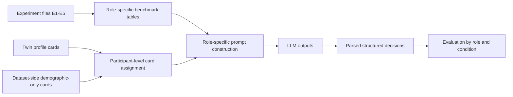

# Two-Stage Trust / Punishment / Helping Pipeline Overview

## Goal

The goal of this proposed benchmark is to simulate role-specific decisions in the two-stage trustworthiness experiments and compare them to human data from the same conditions.

The main question mirrors the PGG benchmark:

1. `baseline`
2. `demographic_only_row_resampled_seed_0`
3. `twin_sampled_seed_0`
4. `twin_sampled_unadjusted_seed_0`

Do Twin-derived profile cards improve prediction of how participants deliberate, act prosocially, and trust others in this task?

## Task Definition

This dataset contains five related experiments.

### Experiment Families

- `E1`: helping with optional cost checking
- `E2`: punishment with optional cost checking
- `E3`: punishment with decision-speed cue
- `E4`: helping with optional impact checking
- `E5`: punishment with optional impact checking

### Stage 1

Player A sees a prior unfair interaction:

- Player 1 sends `10p`
- the transfer triples to `30p`
- Player 2 returns `0p`

Player A then decides whether to:

- help Player 1 or punish Player 2
- and in most experiments optionally check the relevant cost or impact information first

### Stage 2

Player B has `10p` and decides how much to send to Player A.

- the sent amount is tripled
- Player A returns some percentage of the tripled amount

In observable conditions, Player B sees how Player A arrived at the stage-1 choice:

- checked vs did not check
- or in `E3`, fast vs slow

## Canonical Forecasting Units

The cleanest implementation is to treat this as two related benchmark families.

### Player A Benchmark

One forecast record:

- one participant
- one experiment
- one condition

Recommended outputs:

- `E1`, `E2`, `E4`, `E5`: `checked`, `acted_prosocially`, `return_pct`
- `E3a`: `punished`, `decision_time_bucket`, `return_pct`

`decision_time_bucket` is preferable to raw seconds because the theory is about fast vs slow signaling, not exact latency prediction.

### Player B Benchmark

One forecast record:

- one participant
- one experiment
- one condition

Recommended outputs:

- observable conditions: a vector of four conditional send amounts
- hidden conditions: a vector of two conditional send amounts

The exact field names depend on experiment family, but the structure is always "send amounts conditional on what Player A did and, when visible, how that choice was made."

## What Each Mode Means

### 1. Baseline

No participant background card.

The prompt contains:

- the experiment rules
- the role
- the condition
- the structured output schema

### 2. Demographic-only

Variant name:

- `demographic_only_row_resampled_seed_0`

The prompt contains a synthetic participant card built only from target-dataset fields such as:

- age
- gender

This dataset has much less background information than the minority-game or multi-game datasets, so the demographic-only card is intentionally sparse.

### 3. Twin-sampled with demographic correction

Variant name:

- `twin_sampled_seed_0`

The prompt contains one Twin-derived card sampled to match this benchmark population over the fields that overlap cleanly with the target data.

For this dataset, that likely means:

- age
- gender

### 4. Twin-sampled without demographic correction

Variant name:

- `twin_sampled_unadjusted_seed_0`

This uses the same Twin-derived cards without target-dataset correction.

## End-to-End Stages

## Stage 1: Define The Human Reference Set

Recommended config key:

- `experiment_id x role x condition`

Examples:

- `E1 x A x 3`
- `E2 x B x 6`
- `E3a x A x 1`
- `E3b x B x 2`

This preserves the real experimental design and gives repeated human observations within each design cell.

## Stage 2: Build The Task Grounding

The prompt should describe:

- the exact experiment family
- the role being forecasted
- whether the process is observable
- the response schema expected for that role

Unlike PGG, the benchmark should not force everything into a single action transcript. The native structure is stage-conditioned JSON.

## Stage 3: Build The Augmentation Sources

As in PGG, the non-baseline modes are:

- dataset-side demographic-only cards
- Twin-derived cards

The assignment unit is the focal participant only. If we forecast Player B, the synthetic card belongs to Player B, not to the counterpart being judged.

## Stage 4: Assign One Card Per Forecast Record

Each forecasted participant gets:

- zero cards in `baseline`
- one target-dataset demographic card in `demographic_only_row_resampled_seed_0`
- one Twin-derived card in the two Twin modes

There is no need for multi-seat assignment unless we later decide to simulate matched dyads rather than focal respondents.

## Stage 5: Build LLM Inputs

The current `forecasting/` interpretation still applies:

- no observed human prefix
- no within-experiment continuation from a revealed trajectory
- full decision vector generated from the rules and design cell only

## Stage 6: Parse And Evaluate

The parser should be role-aware:

- Player A parsers read check or speed signals, prosocial action, and return percentage
- Player B parsers read conditional send vectors

Evaluation should remain separated by role because the output schemas are not interchangeable.

## Recommended Reading Order

1. [../../non-PGG_generalization/data/two_stage_trust_punishment_y2hgu/README.md](../../non-PGG_generalization/data/two_stage_trust_punishment_y2hgu/README.md)
2. [PIPELINE_OVERVIEW.md](PIPELINE_OVERVIEW.md)
3. [ANALYSIS_OVERVIEW.md](ANALYSIS_OVERVIEW.md)
4. [../PIPELINE_OVERVIEW.md](../PIPELINE_OVERVIEW.md)
